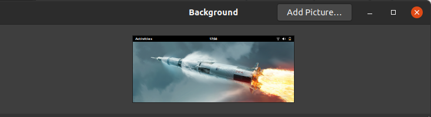

# Gnome 3 widescreen wallpaper rotation script



# Requirements
* Node.js
* Gnome 3

# Description
Pulls the wallpapers posted to r/WidescreenWallpaper and sets them as the wallpaper

# Usage
Clone this repo then run a npm install. e.g.
```
git clone git@github.com:bsimpson/gnome3-wallpaper-rotation.git
cd gnome3-wallpaper-rotation
npm install
```

# Schedule rotation
Put following entry in your crontab to change wallpaper hourly:

```
crontab -e

// Inside crontab editor
0 * * * * bash -c 'cd /path/to/gnome3-wallpaper-rotation/ && npm start'
```
